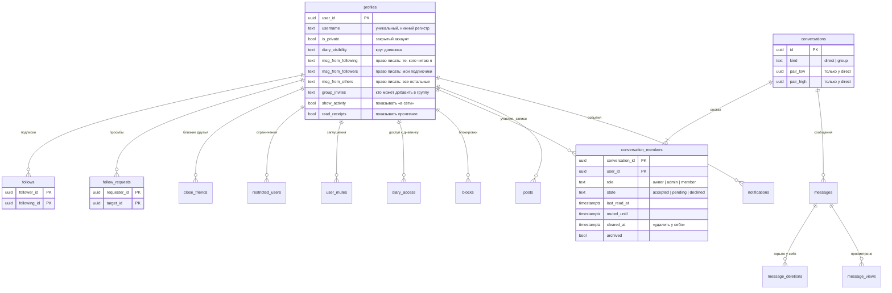
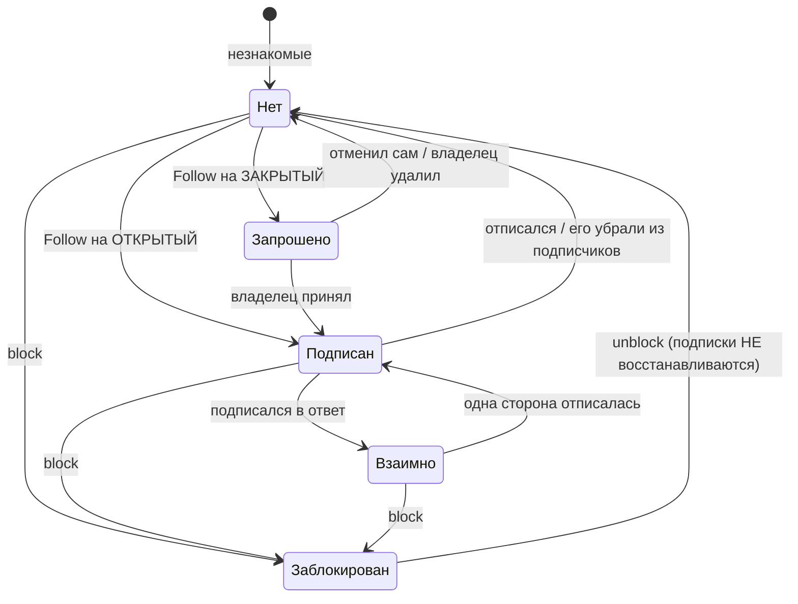
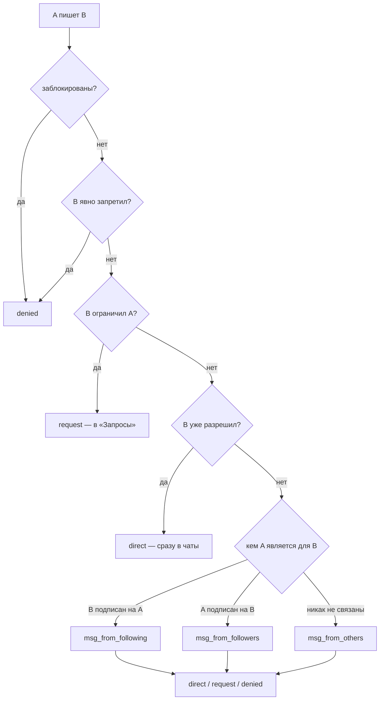
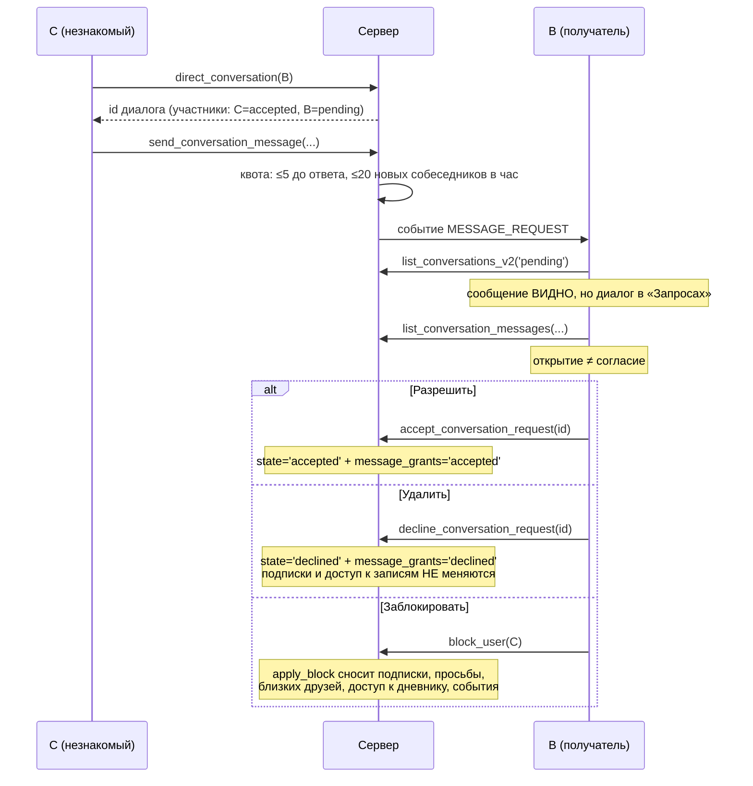
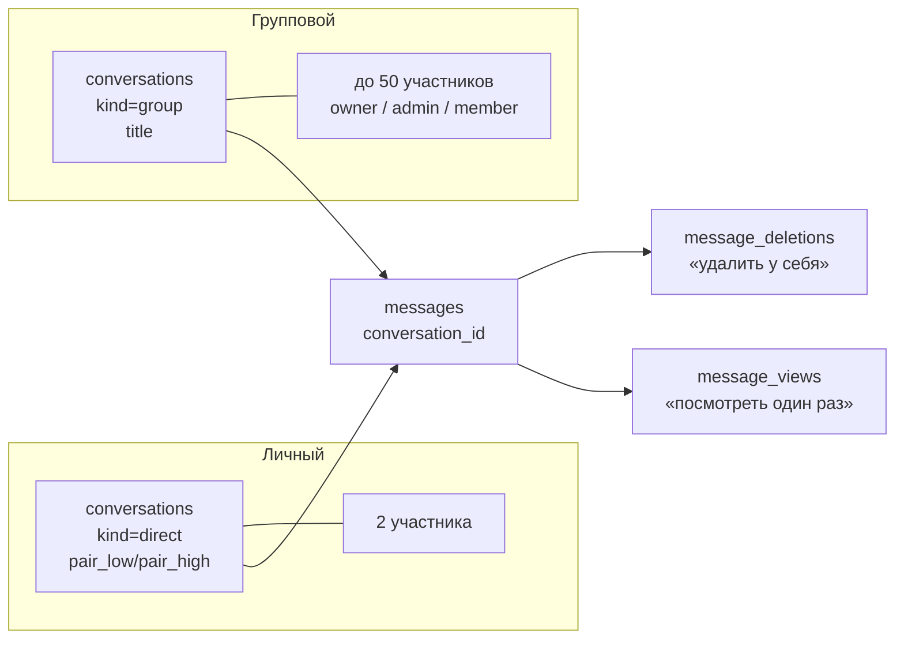

# Социальная система EatAps

Как устроены аккаунты, подписки, приватность и переписка: **что чем является,
кто что решает и где именно стоит граница доступа**.

Этот файл — не пересказ кода. В нём то, чего в коде не видно: почему связи
разделены именно так, что произойдёт с данными при смене настройки и какие
ошибки эта модель предотвращает.

Полный перечень таблиц и функций — в [`supabase/docs/catalog.md`](../supabase/docs/catalog.md)
(генерируется, врать не может). Правила написания миграций — в
[`supabase/docs/`](../supabase/docs/README.md).

---

## 1. Главный принцип: связь — не право

Одна и та же ошибка в этом проекте случалась дважды, и оба раза дорого:
**признак связи использовался как разрешение**.

Сначала «дружба» была одновременно фактом (мы друг у друга в списке) и правом
(значит, можно переписываться и смотреть дневник). Потом её роль пыталась
занять взаимная подписка. В обоих случаях любое расхождение в графе
превращалось в расхождение в правах — и пара оказывалась в состоянии
«переписываться можно, дневник не виден, в списке друг друга нет».

Теперь связи и права разведены полностью:

| Связь | Что означает | Что даёт сама по себе |
|---|---|---|
| `follows` | A читает B | доступ к контенту B по его же настройкам видимости |
| `follow_requests` | A просит разрешения читать B | **ничего** |
| взаимная подписка | A и B читают друг друга | **ничего сверх двух подписок** |
| `close_friends` | B включил A в свой узкий круг | доступ к записям `close_friends` |
| `diary_access` | B поимённо открыл A дневник | доступ к дневнику, поверх настройки |
| `message_grants` | B разрешил или запретил A писать | право писать (или его отсутствие) |
| `blocks` | A отрезал B | запрещает всё, перекрывая любые настройки |
| `restricted_users` | B тихо ограничил A | сообщения A уходят в «Запросы» |
| `user_mutes` | A скрыл B у себя | **ничего** — меняется только то, что видит A |

Ни одна строка не выводится из другой. Право доступа к ресурсу считает **ровно
одна функция**, и она же стоит в политике:

| Ресурс | Функция | Где ещё |
|---|---|---|
| содержимое профиля | `can_view_profile_content()` | политика `posts`, списки людей |
| запись | `can_view_post()` | политика `posts` (развёрнут предикат) |
| дневник питания | `can_view_diary()` | политика `app_state`, `visible_diary()` |
| присутствие | `can_see_activity()` | политика `presence` |
| право писать | `get_message_permission()` | политика `messages`, RPC отправки |
| членство в диалоге | `is_conversation_member()` | политики `conversations`, `messages`, хранилище |

Клиент эти правила **не вычисляет**. `src/lib/relationship.js` читает готовые
ответы сервера и переводит их в состояние кнопки. Единственное, что он считает
сам, — определение, а не право: взаимная подписка есть подписка в обе стороны.

---

## 2. Модель данных



Три решения в этой схеме стоят объяснения.

**`pair_low` / `pair_high` у личного диалога.** Отсортированная пара участников
и уникальный индекс по ней. Без него две одновременные попытки «написать этому
человеку» создают ДВА диалога, и обнаруживается это только по жалобе «он мне
отвечает, а я не вижу».

**`state` на участнике, а не на диалоге.** Запрос на переписку — это состояние
ОДНОЙ стороны: у отправителя диалог обычный, у получателя лежит в «Запросах».
Одно поле на диалог не смогло бы описать это.

**`cleared_at` вместо удаления сообщений.** «Удалить переписку» удаляет её у
меня. Чужая история мне не принадлежит, и трогать её нельзя — поэтому ставится
отсечка по времени, а не DELETE.

---

## 3. Открытый и закрытый аккаунт



**Открытый аккаунт.** Нажатие «Подписаться» создаёт подписку немедленно.
Счётчик растёт, владелец получает событие, доступ к контенту для подписчиков
открывается сразу.

**Закрытый аккаунт.** Нажатие создаёт **просьбу**, а не подписку. До одобрения
человек не подписчик и не имеет никаких прав: `can_view_profile_content()`
возвращает false, `list_posts` отдаёт пусто, прямое чтение `posts` отсекает
политика. Видны только шапка профиля и счётчики — иначе на закрытый аккаунт
нельзя было бы даже попроситься.

Одобрение — **одна транзакция** (`accept_follow_request`): удаление просьбы и
создание подписки. Двумя клиентскими запросами это делать нельзя: обрыв связи
между ними оставляет человека без подписки и без просьбы, то есть без
возможности повторить и без следа, что он вообще просился.

### Что происходит при смене приватности

| Переход | Существующие подписчики | Нерешённые просьбы |
|---|---|---|
| открытый → закрытый | **сохраняются все** | их нет и не было |
| закрытый → открытый | **сохраняются все** | **остаются просьбами** |

Второе — осознанное решение. «Я открываю аккаунт» не равно «я согласен на всех,
кто уже просился»: эти конкретные аккаунты владелец ещё не одобрял. Просьбы
остаются в «Запросах», и он решает по каждой. Тот, кто просился, может просто
нажать «Подписаться» ещё раз — теперь подписка создастся сразу.

Выгонять уже впущенных при закрытии аккаунта тоже нельзя: человек менял правило
на будущее, а не отзывал прошлое.

---

## 4. Матрица приватности

Строки — что смотрим, столбцы — кем является смотрящий. Заблокированный
перекрывает всё и в таблице отдельным столбцом не нуждается: у него везде ✗.

### Открытый аккаунт

| Ресурс | Аноним | Посторонний | Подписчик | Взаимно | Близкий друг | Ограниченный | Заблокирован |
|---|---|---|---|---|---|---|---|
| Шапка профиля, счётчики | ✗ | ✓ | ✓ | ✓ | ✓ | ✓ | ✗ |
| Списки подписчиков и подписок | ✗ | ✓ | ✓ | ✓ | ✓ | ✓ | ✗ |
| Запись `public` | ✗ | ✓ | ✓ | ✓ | ✓ | ✓ | ✗ |
| Запись `followers` | ✗ | ✗ | ✓ | ✓ | ✓* | ✓ | ✗ |
| Запись `friends` (взаимные) | ✗ | ✗ | ✗ | ✓ | ✓* | ✓ | ✗ |
| Запись `close_friends` | ✗ | ✗ | ✗ | ✗ | ✓ | ✓* | ✗ |
| Запись `private` | ✗ | ✗ | ✗ | ✗ | ✗ | ✗ | ✗ |
| Дневник питания | ✗ | по настройке | по настройке | по настройке | по настройке | по настройке | ✗ |
| Личное сообщение | ✗ | по настройке | по настройке | по настройке | по настройке | **⚑ в «Запросы»** | ✗ |
| «В сети» и «был(а)» | ✗ | по настройке | по настройке | по настройке | по настройке | ✗ | ✗ |
| Отметка о прочтении | ✗ | — | по настройке | по настройке | по настройке | по настройке | ✗ |

`✓*` — только если человек ещё и подписчик: круги независимы, близкий друг не
получает записи для подписчиков автоматически, и наоборот.

### Закрытый аккаунт

Всё то же самое, **плюс обязательное условие**: смотрящий должен быть
одобренным подписчиком. Иначе ✗ везде, кроме шапки профиля и счётчиков.

Это касается и записей `public`, и дневника с настройкой `public`. Закрытость —
утверждение «мой контент только для одобренных», и настройка, выставленная год
назад, не должна его отменять. Исключения ровно два, и оба выданы владельцем
руками конкретному человеку: **поимённый доступ к дневнику** (`diary_access`) и
**доступ тренера** (`coach_links`).

### Круг дневника

| Значение | Кто видит |
|---|---|
| `public` | любой вошедший (у закрытого аккаунта — любой одобренный подписчик) |
| `followers` | подписчики |
| `mutuals` | взаимные подписки |
| `close_friends` | список близких друзей |
| `selected` | поимённый список `diary_access` |
| `private` | никто |

Поверх любого значения работают `diary_access` и доступ тренера. Блокировка
перекрывает всё.

### Что не отдаётся никому и никогда

`visible_diary()` собирает ответ из явного списка полей, а не отдаёт блоб
целиком. За его пределами остаются: вес, рост, возраст, пол, цель, уровень
активности, настроение, самочувствие, заметки дня, свои продукты, история
поиска и настройки. Второй слой — `src/lib/friendView.js`: даже если функция
однажды вернёт лишнее, в приложение оно не попадёт.

---

## 5. Право писать

Три категории людей × три возможных ответа, и решает это получатель.



Значения по умолчанию: `following → direct`, `followers → request`,
`others → request`. Они воспроизводят поведение, которое было до появления
настройки, — обновление не меняет никому привычного.

**Ограничение (restrict) проверяется РАНЬШЕ явного разрешения.** Это
намеренно: ограничив человека, которому раньше разрешили писать, вы ожидаете,
что его сообщения уйдут в «Запросы» — а не что старое разрешение окажется
сильнее нового решения.

### Жизненный цикл запроса на переписку



Ответ на запрос **сам считается согласием**: писать в диалог, которого не
хочешь, никто не станет, а требовать нажать «Разрешить» перед ответом — лишний
шаг в самом частом сценарии.

**Квоты — это то, что раньше делала дружба.** Пока личка была открыта только
друзьям, спам в ней был невозможен по построению. Теперь написать может
каждый, поэтому: не больше 5 сообщений одному человеку до его ответа и не
больше 20 новых собеседников в час. Переписка с теми, кто уже ответил или
подписан, не ограничена ничем.

---

## 6. Блокировка, ограничение, заглушение

Три разных действия, которые легко перепутать. Разница в том, **что узнаёт
второй человек** и **что меняется в правах**.

| | Блокировка | Ограничение | Заглушение |
|---|---|---|---|
| Он узнаёт | да, по последствиям | **нет** | **нет** |
| Подписки | снесены в обе стороны | не тронуты | не тронуты |
| Видит мои записи | ✗ | ✓ | ✓ |
| Может писать | ✗ | в «Запросы» | ✓, как обычно |
| Видит «в сети» | ✗ | ✗ | ✓ |
| Его записи в моей ленте | ✗ | ✓ | **✗** |
| Уведомления от него | ✗ | приходят | **не приходят** |
| Кто это видит в базе | обе стороны (по последствиям) | только я | только я |

**Блокировка — серверная операция целиком.** Триггер `apply_block` в одной
транзакции сносит подписки в обе стороны, просьбы в обе стороны, дружбу,
близких друзей, поимённый доступ к дневнику, право писать и все события между
двумя людьми. Клиент не чистит ничего и не должен: половина удаляемого лежит в
строках, которые ему не видны.

Разблокировка **не восстанавливает** подписки. Подписаться заново — отдельное
решение, и принимать его за человека нельзя.

**Ограничение не даёт никаких сигналов.** Ни уведомления, ни изменения в
профиле, ни строки, которую ограниченный мог бы прочитать: у
`restricted_users` есть SELECT-политика только для владельца. В этом весь
смысл — отказ от общения, за который не придётся объясняться.

**Заглушение вообще не касается прав.** Подписка цела, сообщения доходят и
считаются в счётчике диалога, доступ к записям не меняется. Меняется ровно
одно: что показывают мне. Список ведёт сервер (`user_mutes`), а не браузер, —
заглушив человека на телефоне, на ноутбуке от него тоже тихо.

---

## 7. Близкие друзья

Односторонний и **приватный** список. A в списке B ничего об этом не знает и
знать не может: у `close_friends` единственная SELECT-политика —
`auth.uid() = owner_id`. Ни одна функция не отдаёт чужой список и не отвечает
на вопрос «а я у него в близких?».

Это не техническое ограничение, а продуктовое решение: знание «меня убрали из
близких друзей» никому не улучшает жизнь.

Список **независим от подписок**. Близким другом можно сделать кого угодно, и
записи `close_friends` он увидит без всякой подписки. Обратное тоже верно:
близкий друг не получает записи `followers` автоматически.

---

## 8. Диалоги



**Личный диалог не создаётся заранее.** Он появляется в момент открытия
переписки, но в списке не показывается, пока в нём нет ни одного сообщения:
иначе «зашёл в профиль, нажал Написать, передумал» оставляло бы пустую строку
в чатах у обоих.

**Отзыв и удаление у себя — разные действия.**

| | Отозвать у всех | Удалить у себя |
|---|---|---|
| Кому доступно | только автору | любому участнику |
| У собеседника | исчезает, остаётся пометка | **остаётся** |
| Строка в базе | сохраняется пустой | сохраняется |
| Почему не DELETE | на неё ссылаются ответы — цитата осиротела бы | она чужая |

**Прочтение — указателем.** `conversation_members.last_read_at`, а не UPDATE на
каждое сообщение: в переписке на две тысячи реплик разница между этими двумя
способами — три порядка. В личном диалоге дополнительно проставляется
`messages.read_at` — на нём держится «Прочитано» у собеседника; если получатель
выключил отметки о прочтении, оно не проставляется вовсе.

**Реакция — одна на человека.** Хранится как `{ user_id: emoji }`: вторая
реакция того же человека заменяет первую, и дублю взяться неоткуда. Форма
сохранена от прежней модели с единственной морковкой, поэтому не обновлённый
клиент продолжает читать реакции как читал.

### Роли в группе

| Роль | Может |
|---|---|
| `owner` | всё, включая назначение администраторов; убрать себя нельзя |
| `admin` | переименовать, добавить, убрать участника |
| `member` | писать, выйти |

Роль **проверяет сервер** (`conversation_role()` внутри каждой RPC). Интерфейс
не показывает недоступные кнопки — но это удобство, а не защита: вызов без
роли вернёт 42501 независимо от того, что нарисовано.

Выход создателя передаёт роль самому давнему участнику: группа без
администратора становится неуправляемой.

---

## 9. Вложения и хранилище

| Бакет | Публичный | Что в нём | Граница доступа |
|---|---|---|---|
| `chat-images` | да | фото из переписки (историческое) | RLS на `messages` |
| `post-images` | да | картинки записей | RLS на `posts` |
| `dm-media` | **нет** | видео, звук, «посмотреть один раз» | **политика хранилища** |

Разница принципиальная. У публичного бакета границей служит незнание адреса:
URL содержит uuid, не перебирается и не отдаётся ни одним запросом без прав —
но **бакет границей не является**. Для новых вложений этого мало, поэтому
`dm-media` закрыт, путь строится как `{conversation_id}/{user_id}/{файл}`, и
политика пускает только участника диалога. Клиент получает подписанную ссылку
на час.

**«Посмотреть один раз» — удобство, а не защита.** После просмотра сервер
перестаёт выдавать ссылку, но помешать снять скриншот или сохранить кадр
веб-клиент физически не может. В интерфейсе это сказано прямо; обещать
большее — обманывать.

---

## 10. Уведомления

Строка события хранит **структуру, а не текст**: кто (`actor_id`), что
(`type`), с чем (`entity_type`, `entity_id`), подробности (`metadata`). Текст
собирает клиент (`src/lib/notificationModel.js`).

Это не экономия места. Текст, записанный при создании события, нельзя ни
исправить, ни перевести, ни изменить по контексту — «Аня подписалась на вас»
останется в этой формулировке навсегда, включая опечатку и включая случай,
когда Аня успела сменить имя.

| Тип | Когда | Куда ведёт |
|---|---|---|
| `FOLLOW` | подписались (только на ОТКРЫТЫЙ аккаунт) | профиль |
| `FOLLOW_REQUEST` | просятся в подписчики | профиль + кнопки решения в строке |
| `FOLLOW_ACCEPTED` | просьбу одобрили | профиль |
| `FRIEND_ACCEPTED` | подписались в ответ | профиль |
| `POST_REACTION`, `POST_COMMENT` | реакция и ответ на запись | запись |
| `MESSAGE`, `MESSAGE_REQUEST` | сообщение и запрос на переписку | диалог |
| `MESSAGE_REACTION` | реакция на сообщение | диалог |
| `GROUP_INVITE` | добавили в группу | диалог |

Событие «подписался» **не шлётся на закрытый аккаунт**: подписка там
появляется только через одобренную просьбу, о которой владелец уже знает — он
сам нажал «Принять» секунду назад.

Создать событие клиент не может вовсе: у `notifications` нет INSERT-политики, а
`push_notification()` отозвана у `authenticated`. Подделать чужое — тоже:
guard-триггер разрешает получателю менять только `read_at`.

Заглушённый человек (`user_mutes.mute_messages`) не создаёт событий о
сообщениях: непрочитанный бейдж — это и есть тот сигнал, от которого человек
отказался. Сама переписка при этом идёт как обычно.

---

## 11. Realtime

Один канал на тему, сколько бы экранов на неё ни смотрело. Реестр — в
[`src/lib/realtime.js`](../src/lib/realtime.js).

Это не оптимизация. `supabase-js` на одну и ту же тему отдаёт **тот же объект
канала**, а `.on()` для `postgres_changes` и `presence` **бросает исключение**,
если канал уже присоединён:

```
cannot add `postgres_changes` callbacks for realtime:… after `subscribe()`
```

Два компонента, подписавшихся на одну тему, не «получают дубли событий» — они
роняют приложение. Ровно это уже случилось с уведомлениями.

| Тема | Кто слушает | Что приносит |
|---|---|---|
| `notifications:{id}` | бейдж, «События», пуш | новые события и прочтение |
| `follow-requests:{id}` | бейдж «Запросы» | новая и снятая просьба |
| `conv-members:{id}` | список диалогов | новый диалог, решение, прочтение |
| `incoming:{id}` | список диалогов, пуш | входящее личное сообщение |
| `conv:{id}` | открытый чат | сообщения, реакции, отзыв |
| `typing:conv:{id}` | открытый чат | «печатает…» (broadcast) |
| `presence:watch:{id}` | шапка чата | «в сети» |

«Печатает…» и присутствие идут **broadcast/presence**, а не через таблицу:
события эфемерные, писать их в базу незачем.

Все подписки снимаются при размонтировании, а `removeAllRealtimeChannels()`
сбрасывает реестр при выходе из аккаунта: канал прошлой сессии доставлял бы
чужие события в новую.

---

## 12. Границы клиента

Что делает клиент и чего он не делает — короткий список для ревью.

**Делает:**
- переводит ответ сервера в состояние кнопки (`relationship.js`);
- предсказывает результат действия ради мгновенного отклика и **откатывает
  предсказание при ошибке**;
- объясняет человеку, почему он чего-то не видит.

**Не делает:**
- не решает, можно ли что-то показать, — спрашивает;
- не фильтрует полученное от сервера ради приватности (если строка приехала,
  значит, права на неё есть);
- не знает правил закрытого аккаунта: `follow_user` возвращает `'following'`
  или `'requested'`, и кнопка рисует то, что ответил сервер.

Оптимистичные действия и их откат:

| Действие | Предсказание | Откат при ошибке |
|---|---|---|
| Подписка | по `targetIsPrivate` | прежнее отношение + текст ошибки |
| Реакция | эмодзи на пузыре | прежняя реакция + тост |
| Отправка | пузырь со статусом `sending` | статус `failed` + «повторить» |
| Решение по просьбе | строка исчезает | строка возвращается на место |

Повтор отправки уходит с **тем же** `client_id`. Именно это делает его
безопасным: если первая попытка дошла и потерялся только ответ, сервер вернёт
ту же строку, а не создаст вторую.

---

## 13. Что осталось за пределами возможного

Честный список — чтобы не обещать того, чего веб-клиент не может.

| Чего нет | Почему |
|---|---|
| Запрет скриншотов | браузер такого API не даёт; «посмотреть один раз» — удобство, а не защита |
| Сквозное шифрование переписки | сервер обязан проверять права и квоты на содержимом; E2E исключает и то и другое |
| Уведомление «сделан скриншот» | обнаружить его в вебе нечем |
| Исчезающие сообщения по таймеру | требует фонового процесса; сейчас исчезает только «один раз» после просмотра |
| Push при закрытом приложении | нужен серверный Web Push с VAPID; сейчас уведомления показываются, пока вкладка жива |
| Голосовые и видеозвонки | отдельная инфраструктура (WebRTC + TURN), к социальной модели отношения не имеет |
